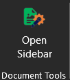
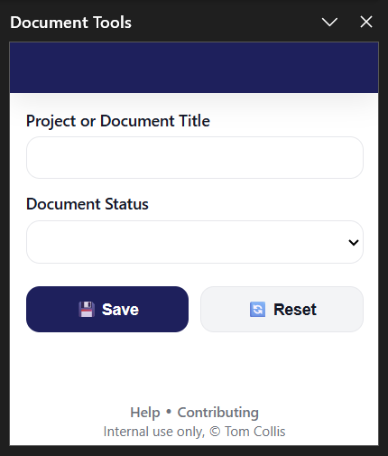
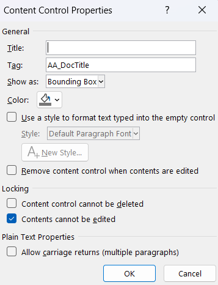

# Tempidoc
*Pronounced:* **tem.pee.doc**

[](https://github.com/tomcollis/Tempidoc/stargazers)
[](https://github.com/tomcollis/Tempidoc/issues)
[](https://github.com/tomcollis/Tempidoc/forks)
[](https://github.com/tomcollis/Tempidoc/releases/latest)

## Overview

This repo contains a Word Addin (or Add-in) that has the following functionality:
    - Update Content Control fields with Values defined in a task pane.

It is designed to work for Microsoft Word on Windows Desktop, macOS Desktop and Web.

If you like this idea or find the app useful, why not?

[](https://paypal.me/TomCollisUK/4)

### Screenshots


> Ribbon Button - Word for Desktop


> User Interface - Word for Desktop


> Content Control Properties - Word for Desktop

## Getting Started

1. Fork the main branch from the repository.
2. You need to define your settings in **config.json**, the easiest method is to edit **config.example.json** to **config.json** and populate your settings via the GitHub Website:
    - brandName: Used for Copyright footer.
    - brandColor: Use HTML colour code (to ensure legibility and accessibility choose a dark colour.)
    - helpUrl: Webpage for support, defaults to main GitHub repo issues.
    - fields: variable with your fields (guidance is [below](#fields-in-configjson)).
3. Optional
    - Change /assets/brand-logo.png to your logo (or leave the blank PNG if you prefer).
        - Keep the file size small (because why not.)
        - The height should be 35px, and it can be **up to** 160px wide.
    - Update Footer link for Contributing in footer-links to org specific URL in taskpane.html or remove it.
4. Host your files
    - The taskpane.*, config.json and assets folder must be hosted and available globally.
    - You could use:
        - GitHub Pages
        - Cloudflare Pages
        - Docker with NGINX & Reverse Proxy
        - Docker with NGINX & Cloudflare Tunnel
        - Generic Web Hosting
5. Download and update all URLs in **manifest.xml** to your new hosted files.
6. Add your Addin using your downloaded, modified **manifest.xml** to Microsoft Word (the complicated bit, from easy to difficult).
    - **Word with Microsoft 365 Tenant**: If you have a Microsoft 365 tenant, then the process is pretty seamless, [Upload Custon Add-ins via the Microsoft 365 Admin Center](https://learn.microsoft.com/en-us/microsoft-365/admin/manage/office-addins?view=o365-worldwide#upload-custom-office-add-ins-in-your-organization). The Add-in will then be available via the Desktop and Web apps.
    - **Word for the Web only**: If you don't have a Microsoft 365 tenant, you can [Upload the Add-in direct in Word for the Web](https://learn.microsoft.com/en-us/office/dev/add-ins/testing/sideload-office-add-ins-for-testing#manually-sideload-an-add-in-to-office-on-the-web).
    - **Word Desktop - Windows only**: [Create a network share and create a Trusted Add-in Catalog](https://learn.microsoft.com/en-us/office/dev/add-ins/testing/create-a-network-shared-folder-catalog-for-task-pane-and-content-add-ins).
    - **Word Desktop - Mac only**: [Place manifest.xml in a specific folder](https://learn.microsoft.com/en-us/office/dev/add-ins/testing/sideload-an-office-add-in-on-mac).
    - **Word app - iPad only**: [Place manifest.xml in a specific folder](https://learn.microsoft.com/en-us/office/dev/add-ins/testing/sideload-an-office-add-in-on-ipad).

## Creating Document

The ideal solution is that you create a document template (.docx or .dotx) which is prefilled with Plain Text Content Controls.

As of 16/MAY/2026, you can only insert Plain Text Content Controls by using the Desktop Word app on Windows or macOS. Once you've created a document it can be updated in Word for Web using this Addin.

To insert a content control element, you must first enable the Developer Toolbar.

1. [Enable Developer Tab in Word](https://support.microsoft.com/en-gb/office/show-the-developer-tab-in-word-e356706f-1891-4bb8-8d72-f57a51146792)
2. Select place in Document to insert a field.
3. Insert Plain Text Content Control, you can **not** use Rich Text Content Controls.
4. Select your Plain Text Content Control, and click 'Properties' on the Developer Toolbar.
5. Add a Tag which matches your configured fields *e.g. AA_DocTitle*.
6. *(optional)* You can add a Title but it only shows if you click on the field or if you configure 'Show as:' to 'Start/End Tag'. Neither of these improve the user experience IMHO, hence this step is optiona.
7. *(optional)* You can also configure a Style to be used by the text. This is useful for Document Title or text that is headings/footers.
8. *(recommended but optional)* If you enable 'Design Mode' on the Developer Toolbar. You can amend the text shown when a field is empty *e.g. New Un-populated Template*. This is particular useful to guide individuals to use the Addin, seek support or refer to documentation.

## Fields *(in config.json)*

Fields is a JSON array in config.json, so make sure your JSON is valid, a useful tool for checking your entire config.json is [JSONLint](https://jsonlint.com/).

### Example

```json
"fields": [
    { "key": "AA_DocTitle", "label": "Document Title", "type": "string" },
    { "key": "AA_DocAuthor", "label": "Document Author", "type": "string" },
    { "key": "AA_DocStat", "label": "Document Status", "type": "dropdown", "choices": ["Draft", "Submitted", "Approved", "Published", "Archived"] }
]
```

| field | required | usage | example |
| - | - | - | - |
| `key` | Yes | This value must match exactly (case-sensitive) to the 'tag' used on the Plain Text Content Control in your Word Document. You can use anything, I prefer to use a prefix. | `"key": "AA_DocTitle"` |
| `label` | Yes | This value is used in the Addin Task Pane for the field name. It should be user-friendly. | `"label": "Document Title"` |
| `type` | Yes | You can choose 'string' or 'dropdown'. This only impacts the Addin Task Pane, it doesn't impact the Content Control in the document which should always be a Plain Text Content Control. | `"type": "string"` OR `"type": "dropdown"` |
| `choices` | Only for type of "dropdown" | These are the options available in the Addin Task Pane. | `"choices": ["Yes", "No"]` |

You can define as many fields as you like, if a defined field doesn't exist in the open document then the field will be hidden automatically.

## Updating

From time to time, I may provide updates, fixes and additional functionality.
These updates will not impact config.json in any way, so your custom configuration will remain intact.
If you've forked this repo (as recommended) and are hosting the Addin directly from your own repo, you can safely pull or merge upstream changes without losing any of your configuration.

If changes are added to the config.json, these will be reflected in config.example.json first, and the version will be incremented appropriately.
